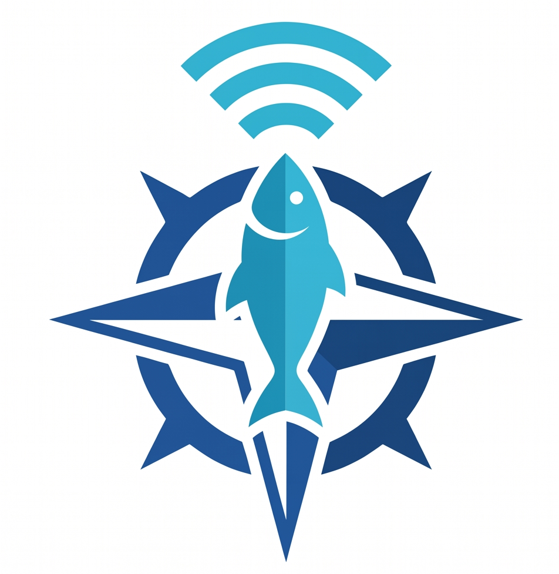

# BlueVantage: Fishing Zone Prediction Engine



## 🎯 Project Overview

**BlueVantage** is an intelligent fishing zone prediction system that uses advanced machine learning and real-time environmental data to identify optimal fishing locations in the North Sea, specifically centered around **Urk Harbor** in the Netherlands. 

This system was developed for the **CASSINI Hackathon** and aims to support sustainable fishing by providing data-driven insights into fish distribution and optimal fishing zones.

## 🌊 About the System

BlueVantage combines multiple data sources to predict catch probability across a spatial H3 hexagonal grid:

- **ICES DATRAS Data**: Historical catch records from the International Council for the Exploration of the Sea (ICES) database
- **Copernicus Marine Data**: Real-time and historical Sea Surface Temperature (SST) and Chlorophyll concentrations
- **EMODnet Data**: Bathymetry (water depth) and Marine Protected Area (MPA) information
- **Machine Learning Model**: XGBoost classifier trained to predict high-catch probability zones

## 📋 Project Structure

```
bluevantage/
├── README.md                           # This file
└── .git/

bluevantage-api/
├── main.py                             # FastAPI server
├── requirements.txt                    # Python dependencies
├── Procfile                            # Deployment configuration
├── zones.json                          # Generated fishing zone predictions
├── sql_create.txt                      # Database schema
└── __pycache__/

model/
├── prediction_engine_urk.ipynb        # Main Jupyter notebook with full pipeline
└── [data files generated at runtime]

dataset/
└── [Raw data files]

[PDF Documentation]
├── BlueVantage-ProductSpecs.pdf       # Product specifications
├── BlueVantage-Master.pdf
├── BlueVantage-theStartup.pdf
└── CASSINI - BlueVantage - Report.pdf
```

## 🚀 Quick Start

### Prerequisites

- Python 3.8+
- pip or conda package manager
- Copernicus Marine Account (for environmental data)
- ICES DATRAS access (API is public)

### Installation

1. **Clone the repository**
   ```bash
   git clone <repository-url>
   cd bluevantage
   ```

2. **Install dependencies**
   ```bash
   # For the prediction engine
   cd model
   pip install -r requirements.txt
   
   # Or use the API requirements
   cd ../bluevantage-api
   pip install -r requirements.txt
   ```

## 📊 Running the Prediction Engine

The core prediction engine is in `model/prediction_engine_urk.ipynb` - a Jupyter notebook that implements the complete pipeline:

### Step 1: Environment Setup
```jupyter
python -m jupyter notebook model/prediction_engine_urk.ipynb
```

### Step 2: Authenticate with Copernicus Marine
The notebook will prompt for Copernicus credentials:
```
COPERNICUSMARINE_SERVICE_USERNAME: <your-email>
COPERNICUSMARINE_SERVICE_PASSWORD: <your-password>
```

### Execution Steps in Notebook

1. **Environment Setup** - Install required packages and configure paths
2. **Download ICES DATRAS Data** - Retrieves historical haul and catch records from ICES
3. **Fetch Copernicus Marine Data** - Downloads SST and Chlorophyll concentration data (2018-2024)
4. **EMODnet Integration** - Retrieves bathymetry and MPA boundaries
5. **H3 Hex Grid Generation** - Creates hexagonal spatial grid at resolution 6
6. **Spatial Join** - Aggregates all features to hex cells
7. **Training Dataset Creation** - Prepares data from ICES catch records
8. **Model Training** - XGBoost classifier for catch probability prediction
9. **Prediction & Ranking** - Scores all operational zones
10. **Visualization** - Maps prediction results and model insights

## 🌐 Running the API

The BlueVantage API provides REST endpoints to access fishing zone predictions:

### Start the API Server

```bash
cd bluevantage-api
python main.py
```

Server runs on `http://localhost:8000`

### API Endpoints

#### Health Check
```bash
GET /
```
Response:
```json
{
  "status": "ok",
  "message": "Welcome to BlueVantage API"
}
```

#### Get All Zones
```bash
GET /api/zones
GET /api/zones?limit=10
```

#### Get Specific Zone
```bash
GET /api/zones/{hex_id}
```

### Interactive API Documentation
- Swagger UI: `http://localhost:8000/docs`
- ReDoc: `http://localhost:8000/redoc`

## 🔧 Technical Architecture

### Data Pipeline

```
ICES DATRAS          Copernicus Marine          EMODnet
    ↓                      ↓                        ↓
Catch Records    +    SST/Chlorophyll    +    Bathymetry/MPAs
    ↓                      ↓                        ↓
    └──────────────────────┴────────────────────────┘
                           ↓
                 H3 Hexagonal Grid (Res 6)
                           ↓
                 Feature Aggregation
                           ↓
                  Training Dataset
                           ↓
               XGBoost Classification Model
                           ↓
              Fishing Zone Predictions (Probability Scores)
                           ↓
                    zones.json Output
```

### Key Features Used in Model

- **Spatial Features**:
  - Latitude & Longitude
  - Distance from Urk Harbor (km)
  - H3 Hexagon ID
  - Water Depth (m)

- **Environmental Features**:
  - Sea Surface Temperature (°C)
  - Chlorophyll Concentration (mg/m³)
  - Marine Protected Area Status

- **Temporal Features**:
  - Season Week
  - Historical CPUE (Catch Per Unit Effort)

- **Species Tracked**:
  - Plaice
  - Sole
  - Cod
  - Herring
  - Mackerel

### Model Details

- **Algorithm**: XGBoost Classifier
- **Target**: High-catch probability (binary classification)
- **Training Data**: ICES DATRAS hauls (2018-2024) from North Sea
- **Operational Area**: 
  - Latitude: 52.3° - 53.4° N
  - Longitude: 4.6° - 6.4° E
  - Center: Urk Harbor (52.662°N, 5.601°E)

## 📦 Output Format

The `zones.json` file contains predictions for all operational hexagons:

```json
[
  {
    "hex_id": "8625cd...",
    "lat": 52.8,
    "lon": 5.3,
    "sst_celsius": 12.5,
    "chl_mg_m3": 1.2,
    "depth_m": 25.5,
    "is_mpa": false,
    "probability": 0.75,
    "rank": 1
  },
  ...
]
```

## 🔐 Required Credentials

### Copernicus Marine
- Create account at: https://marine.copernicus.eu/
- Required for SST and Chlorophyll data downloads
- Accessed via environment variables or notebook prompts

### ICES DATRAS
- Public API - no credentials required
- Data accessed via: https://datras.ices.dk/WebServices/

## 📚 Data Sources

| Source | Type | Coverage | Update Frequency |
|--------|------|----------|-----------------|
| ICES DATRAS | Historical Catch | 2018-2024 | Annual |
| Copernicus Marine | SST/Chlorophyll | Monthly | Near-real-time |
| EMODnet | Bathymetry/MPAs | Static | Annual |
| Haversine | Distance Calculations | Calculated | Real-time |

## 🛠️ Dependencies

### Core Libraries
- **pandas**: Data manipulation
- **numpy**: Numerical computing
- **xgboost**: Machine learning model
- **scikit-learn**: ML utilities
- **geopandas**: Geospatial operations
- **shapely**: Geometric operations
- **h3**: Hexagonal binning
- **scipy**: Scientific computing
- **requests**: HTTP requests
- **matplotlib**: Visualization
- **netCDF4**: NetCDF file handling
- **copernicusmarine**: Copernicus API client

### API Framework
- **FastAPI**: Modern Python web framework
- **uvicorn**: ASGI server

## 🎓 Key Concepts

### H3 Hexagonal Grid
The model uses Uber's H3 library to create a hexagonal spatial grid at resolution 6, which provides roughly 1.5 km² cells in the operational area. This enables consistent spatial aggregation of catches and environmental data.

### CPUE (Catch Per Unit Effort)
Historical CPUE is calculated from ICES hauls and normalized between 0-1 to represent the historical productivity of each hex cell.

### Production Mode
The system runs in "fail-fast" mode - it requires real data from all sources and will not proceed if critical data sources are unavailable.

## 🔄 Workflow Example

1. **Initialize**: Run notebook with Copernicus credentials
2. **Fetch Data**: Download ICES, Copernicus, and EMODnet data
3. **Build Features**: Create hex grid with environmental features
4. **Train Model**: XGBoost classifier learns historical patterns
5. **Predict**: Score all operational zones
6. **Export**: Save to `zones.json`
7. **Serve**: API endpoints provide predictions to frontend

## 📝 Notes

- The operational area is centered on **Urk Harbor** (52.662°N, 5.601°E)
- Current data covers **2018-2024** period
- Model generates predictions for **~100+ hexagonal zones** in the North Sea
- All coordinates use **WGS84 (EPSG:4326)** projection

## 🤝 Contributing

Contributions are welcome! Areas for enhancement:

- Additional species prediction models
- Real-time data integration
- Forecast modeling (using weather/climate data)
- Performance optimization
- Extended operational areas
- Mobile app integration

## 📄 License

[Add appropriate license]

## 👥 Credits

Developed for the **CASSINI Hackathon** 2026

**Data Partners:**
- ICES (International Council for the Exploration of the Sea)
- Copernicus Marine Service
- European Marine Observation and Data Network (EMODnet)

## 📞 Support

For issues, questions, or suggestions:
- Check the PDF documentation files
- Review notebook comments for implementation details
- Inspect API logs for debugging

---

**Last Updated**: April 2026
