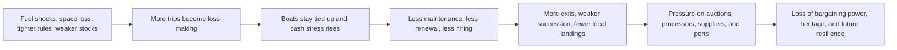

# What Keeps Local Fishermen in the Netherlands Up at Night

## Executive summary

Across the Dutch fishing sector in the past six months, one fear stands above the rest: **being unable to earn a living even when the boat is technically allowed to fish**. The strongest evidence comes from the spring 2026 fuel shock, when much of the boomkor fleet stayed tied up because trips had turned loss-making, followed by emergency EU and Dutch support measures. But fuel is only the most visible pressure. Behind it sits a deeper trio of anxieties: **loss of fishing space, loss of regulatory certainty, and loss of long-term business continuity**. citeturn22search0turn22search2turn10search11turn12search1turn14search2turn14search4

The second-order fear is existential: many fishermen increasingly worry that they are **being pushed into a narrower and more fragile operating space**. The evidence is broad and recent: new or ongoing closures in protected areas, the partial closure of entity["place","Doggersbank","north sea shoal"], North Sea rezoning for offshore wind, continuing Natura 2000 management disputes, and the fact that access inside wind parks remains mostly limited to pilot-scale or passive-fishery concepts rather than normal commercial fishing. citeturn25search0turn25search1turn7search1turn7search2turn13search9

A third major concern is **what they are afraid of losing** if these trends continue: not only income, but also boats, quotas, local landings, bargaining power in the chain, market position, and family continuity in fishing communities. The public record shows repeated warnings about the chain effects on auctions, processors, suppliers, and jobs in coastal regions, while youth-oriented courses and media coverage about “who still chooses this life” strongly suggest a sector worried about succession and the survival of fishermen’s know-how. citeturn22search0turn10search7turn10search15turn11search2turn12search2turn20search0turn20search3

Mental-health evidence specific to Dutch fishermen is thinner than the economic and regulatory evidence, so it should be treated cautiously. Still, the language used in recent reporting is unusually stark—“acute crisis,” “water at our lips,” worries about pension, crews, and families—and sector groups have explicitly argued that some control rules create safety risks and unintentional violations at sea. Together, those are credible signals of mounting strain, even if they do not amount to a formal in-window mental-health survey of fishermen themselves. citeturn13search5turn12search9turn22search3turn12search0

## What the evidence says

The ranking below is **qualitative**, based on how often a fear recurred across recent Dutch official sources, fishermen’s organizations, trade media, regional news, NGOs, and public social posts.

| Rank | Fear | Qualitative prevalence | Evidence and examples | Sources |
|---|---|---|---|---|
| 1 | Fuel-driven income collapse | Very high | In March and April 2026, a large share of the Dutch fleet stayed in port because trips had become loss-making; one skipper said the standstill was costing about €5,000 per day, and sector groups warned of continuity risks. Emergency EU and Dutch support followed. citeturn22search2turn22search3turn12search1turn14search2turn14search4 | citeturn22search0turn22search2turn10search11turn12search1turn14search2turn22search7 |
| 2 | Loss of fishing grounds and sea space | Very high | Fishermen face a cumulative squeeze from offshore wind expansion, protected-area closures, and area-based management. The cabinet’s March 2026 North Sea rezoning added more wind-energy space, while closures on Doggersbank and other protected grounds remain active. Access in wind parks is still mainly framed around limited passive-fishery opportunities. citeturn7search2turn25search0turn25search1turn7search1turn13search9 | citeturn7search2turn25search0turn25search1turn7search1turn13search9 |
| 3 | Weaker stocks, quota cuts, climate shifts, and polluted waters | High | The 2026 TAC deal cut several key pelagic opportunities, eel again received zero-catch scientific advice, the North Sea is warming and shifting species composition, and PFAS pollution around the entity["place","Westerschelde","zeeland estuary"] is still tied to direct financial damage claims by fishermen. citeturn18search8turn17search2turn4search16turn16search11turn28search13 | citeturn18search8turn17search2turn4search16turn16search11turn28search13turn28search21 |
| 4 | Regulatory burden, enforcement risk, and fines | High | New 2026 rules increased traceability, transport reporting, VMS obligations, and documentation requirements. European sector groups warned the control regime could create unintentional breaches, large fines, and even safety problems at sea. citeturn17search1turn18search16turn13search5turn27search13turn23search2 | citeturn17search1turn18search16turn13search5turn27search13turn23search2 |
| 5 | Loss of market access, margins, and pricing power | High | Sector groups say higher costs cannot easily be passed through because of the Dutch auction structure; meanwhile, recent research says direct-sale and short-chain options exist but remain fragmented, and certification remains important enough that the demersal fleet is going through full MSC recertification. citeturn22search0turn18search0turn18search2turn18search4turn19search0 | citeturn22search0turn18search0turn18search4turn19search0 |
| 6 | Forced fleet shrinkage and becoming “old iron” | Medium-high | Recent reporting still frames the sector through sanering, sloop, and a loss of perspective for the boats that remain. In crisis coverage, fishermen warned that if conditions persist, vessels risk ending up as little more than scrap. citeturn10search15turn19search2turn22search3turn22search7 | citeturn10search15turn19search2turn22search3turn22search7 |
| 7 | Crew shortages, succession risk, and loss of heritage | Medium-high | Public evidence repeatedly circles back to the same question: who still wants this life? Training for young fishermen is being actively promoted, and recent media projects focus explicitly on young entrants trying to build a future in a sector “under pressure” and “changing fast.” citeturn11search2turn12search2turn12search14turn20search0turn20search3 | citeturn11search2turn11search18turn12search2turn20search0turn20search2turn20search3 |
| 8 | Safety at sea and psychological strain | Medium | The evidence is weaker and more indirect than for fuel or space, but it is still real: the sector warns that some control rules undermine safety, recent safety guidance emphasizes vessel checks and insurability, and crisis reporting explicitly links cost pressure to worries about pensions, crews, and families. citeturn13search5turn13search2turn22search3turn12search0 | citeturn13search5turn13search2turn22search3turn12search0 |

Representative quotes from the six-month evidence base:

> “Je zou nu veel geld moeten toeleggen om naar zee te gaan.” (“Right now you would have to put in a lot of money just to go to sea.”) citeturn22search2

> “Het water staat onze leden letterlijk aan de lippen.” (“The water is literally at our members’ lips.”) citeturn12search9

> “De huidige regels ondermijnen de veiligheid op zee…” (“The current rules undermine safety at sea…”) citeturn13search5

> “Wie kiest er nog voor het vissersvak?” (“Who still chooses the fishing profession?”) citeturn12search2

> “Geen enkele vangst als duurzaam kan worden beschouwd.” (“No catch can be considered sustainable.”) citeturn17search2

> “Als dit langer aanhoudt, verliezen we de markt.” (“If this continues longer, we lose the market.”) citeturn22search7

## Why these fears are rational

The economic case is straightforward. The sector’s cost base is still structurally exposed to diesel, and when prices spike, fishermen cannot simply pass the increase on to buyers. Dutch sector groups explicitly say the auction structure blocks easy pass-through, and recent Dutch reporting showed that even boats with legal access to fish were staying tied up because fishing itself had become a losing transaction. That is why the recent crisis rapidly escalated from “high fuel prices” to “continuity of the sector.” citeturn22search0turn22search2turn10search11turn12search1turn14search4

The regulatory and spatial fear is equally rational. Dutch fishermen do not experience closures, wind parks, Natura 2000 measures, and traceability reforms as separate policy files; they experience them as a cumulative narrowing of room to operate. The recent record shows new or maintained closures, more offshore wind claims on sea space, new electronic and reporting obligations, and continuing warnings from the sector that complexity itself is becoming an operational risk. citeturn7search2turn25search0turn25search1turn13search9turn17search1turn18search16turn13search5

The environmental fear is not just abstract “green pressure.” It is tied to concrete revenue risk. When quotas for species such as herring and mackerel are cut, or when eel again receives zero-catch scientific advice, fishermen see less room to earn. When the North Sea warms and species composition shifts, that creates uncertainty over what can be caught, where, and with what gear. And when pollution becomes commercially salient—as in the recent compensation discussion over PFAS damage around the Westerschelde—it turns ecology into lost business. citeturn18search8turn17search2turn4search16turn16search11turn28search13

The social fear is also evidence-based. Recent Dutch public material keeps returning to family firms, young fishermen, and the question of whether there is still a viable future worth inheriting. The media series entity["tv_show","Vissermannen","pointer view 2026"] and public posts from entity["organization","ProSea Marine Education","maritime training nl"] are telling because they frame the issue not as romance, but as a struggle to build a future in a fast-changing sector. When a sector starts investing this visibly in “young ambitious fishermen,” it usually means succession is no longer assumed. citeturn12search2turn12search14turn20search0turn20search2turn20search3

## Consequences if they do not act

If fishermen and their organizations do not reduce fuel exposure, defend access, improve compliance capacity, and strengthen margins, the most likely near-term result is **more days tied up, more cash burn, and less willingness to invest in maintenance, crew, and renewal**. That is already visible in spring 2026 reporting and in the emergency logic of the support packages themselves. citeturn22search2turn22search3turn12search1turn14search2turn14search4

The next step is **a chain reaction ashore**. Lower landings weaken auctions, processors, merchants, suppliers, and local employment. Sector groups made that argument directly in recent crisis communications, and regional reporting from fishing ports echoed the same concern: the pressure is no longer confined to the skipper and vessel. citeturn22search0turn10search7turn10search15

Longer term, inaction would probably mean a **smaller, older, and more brittle** Dutch fishing sector: fewer boats, more dependence on a narrower set of grounds and species, less bargaining power, more vulnerability to the next fuel shock, and weaker generational handover. The combination of space loss, quota pressure, climate shifts, contamination disputes, and fragmented direct-sales alternatives points in that direction. citeturn7search2turn25search0turn18search8turn16search11turn28search13turn18search0

That flow is not speculative policy theatre; it is the plain-language version of what Dutch fishermen’s groups, regional media, NGOs, and the government are all describing from different angles. citeturn22search0turn22search2turn10search15turn12search1turn7search2turn25search0

## Priority actions fishermen could take

**Treat diesel exposure as a daily risk-management issue, not a temporary annoyance.** In practice, that means stricter trip-level go/no-go thresholds, active use of emergency support where available, and faster uptake of energy-efficiency investments that already fit existing subsidy routes. The recent crisis showed how quickly profitability disappears when fuel spikes. citeturn12search1turn14search2turn14search4turn23search2

**Defend fishing space earlier and more collectively.** Fishermen have a stronger position when they engage before spatial plans harden: in North Sea rezoning, Natura 2000 management, and wind-park access design. The public record suggests that waiting until closure is final usually leaves only compensation and compliance, not co-design. citeturn7search2turn13search9turn25search0turn25search1turn7search1

**Protect market access and margins at the same time.** That means staying ahead of traceability and documentation rules, keeping certification credible, and using short-chain or direct-sales options where they genuinely improve margins. Recent work on Dutch short chains suggests opportunity exists, but it is still too fragmented to help by itself unless fishermen organize it deliberately. citeturn18search16turn17search1turn19search0turn18search0turn18search4

**Build optionality in species, gear, and business model.** Where legal and economically sensible, the sector needs more freedom to switch toward healthier stocks, more fuel-efficient techniques, passive-fishery opportunities, local branding, and side revenues linked to circularity and environmental services. The basic logic is to be less dependent on any one stock, one gear, or one price regime. citeturn18search8turn16search11turn23search2turn13search21

**Make succession a formal business priority now.** If younger fishermen are to remain, they need a path into leadership, finances, and governance—not just deck work. The recent youth-focused training activity is a signal that this is already understood inside the sector, but it needs to move from ad hoc courses to normal business planning. citeturn11search2turn11search18turn20search0turn20search2turn20search3

**Treat mental strain and safety as operational risks.** The in-window evidence is not strong enough to quantify the mental-health burden of Dutch fishermen specifically, but it is strong enough to justify action: peer-support, referral routes, debt and family-strain check-ins, and a hard line that compliance systems must not worsen safety at sea. citeturn13search5turn13search2turn22search3turn12search0

**In contaminated waters, document losses and pursue clarity fast.** The recent Westerschelde compensation discussion shows that pollution can become a direct fishery issue, not just an environmental one. In such areas, documenting lost grounds, affected catches, and the chain effects on sales is likely to matter. citeturn28search13turn28search21

## Assumptions and limitations

**Assumptions**

- Timeframe: **past 6 months only**, interpreted as roughly **25 October 2025 through 25 April 2026**.
- Output language: **English**.
- Scope: **the Netherlands**, with emphasis on the North Sea, the Wadden area, and inland/coastal fisheries.
- Personal data: **excluded**. Public social posts were used only as contextual signals; no usernames were needed.

**Limitations**

- Public **Reddit/forum evidence in-window was sparse and noisy**, so it was weighted lightly relative to official, sector, trade, and regional-news sources.
- The evidence for **mental health** is materially weaker than the evidence for fuel, regulation, space loss, and margins. I therefore treated mental health as a secondary finding, supported by crisis language, safety complaints, succession activity, and an adjacent Dutch primary-sector mental-health factsheet rather than a recent fishers-only survey. citeturn13search5turn22search3turn12search0
- Pollution concerns were visible, especially around PFAS and contaminated waters, but in this six-month window they appeared **less frequently** as direct fisherman-voiced fears than fuel, closures, compliance burden, and profitability. citeturn28search13turn28search21